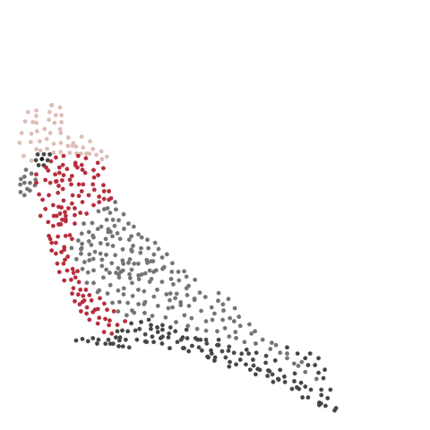

layout: false
class: split-33 with-thick-border border-black

```{css, echo=FALSE}
/* custom.css */
:root{
  --main-color1: #2f4c7a;
  --main-color2: #bcbddc;
  --main-color3: #efedf5;
  --main-color4: #9DDAE5;
  --text-color3: black;
  --text-color4: black;
  --code-inline-color: #4e5054;
  --link-color: #006CAB;
  --logo: url(http://www.fragiletoagile.com.au/wp-content/uploads/2018/02/monash-university-logo-transparent.png);
}
.huge { font-size: 300% }
.large { font-size: 150% }
.largeish { font-size: 120% }
.summarystyle { font-size: 150%;
  line-height:150%;}
```

```{r setup, include=FALSE}
options(htmltools.dir.version = FALSE, width = 120)
library(tidyverse)
library(knitr)
library(kableExtra)
library(htmltools)
library(icon)
opts_chunk$set(
  echo = FALSE, warning = FALSE, message = FALSE, comment = "#>",
  fig.path = 'figure/', cache.path = 'cache/', fig.align = 'center',
  fig.width = 12, fig.height = 4, fig.show = 'hold',
  cache = TRUE, external = TRUE, dev = 'png', dev.args = list(bg = "transparent")
)
mp4_vid <- function(src, width){
  HTML(
    paste0(
      '<video width="', width, '" autoplay>
        <source src="', src, '" type="video/mp4">
      </video>'
    )
  )
}
```

.column[.bottom_abs.content[

]]

.column.bg-main1[.content.vmiddle[.center[


# Visualising high-dimensional data


### New developments of the tourr package using Shiny and plotly
<br>
<br>

# Ursula Laa


### School of Physics and Astronomy
### &
### Department of Econometrics and Business Statistics

]]]

---
class: center
background-image: url("images/cms_event_display.jpg")
background-size: contain


<br>

--
.large[
<div class="white">
Particle physics experiments are highly complex
</div>
]
<br>


--
.large[
<div class="white">
We make sense of them using computational tools, e.g. simulations and global fits
</div>
]
<br><br><br><br><br><br>
<br><br><br><br><br><br>
<br><br><br>

--
.large[
<div class="white">
Visualisation is playing an important role in understanding our results
</div>
]
<br>


--
.large[
<div class="white">
Generally we reduce dimensionality and look at one or two dimensional visualisations
</div>
]

---

# Example: PDFSense data

<br>

.large[
__PDFSense__ [arXiv:1803.02777] aims to study the sensitivity of hadronic experiments to nucleon structure, encoded in "fit residuals" (defining a 56 dimensional parameter space)
]
<br>
--

.large[__Objective__: by studying the fit residuals we learn about
* grouping: show how different types of measurements constrain different directions in parameter space
* relevance to the fit: the residuals encode the sensitivity of the fit to single measurements, so finding observables that are different from the main distribution (i.e. all the other measurements) means finding those which are expected to be important in future fits
]
<br>
--

.large[Visualisation is a great way of addressing these questions!<br>(see [arXiv:1806.09742])]

---
layout: false
class: split-33

.column[.content[
# Using PCA
<br>


.largeish[To reduce dimensionality we use principal component analysis]

<br>
.largeish[As an example we can look at a subset of the data to compare similar measurements along the first two principal components]

<br>
.largeish[This reveals some interesting features (especially for the CMS8 measurements)]

<br>
.largeish[But in this case the first four principal components contain considerable variance!]

<br>
.largeish[Let's use the grand tour to look at the four dimensional space!]

]]

.column[.content.center.vmiddle[
]]

---
layout: false
class: split-33

.column[.content[

# Grand tour animation
 <br>
```{r, eval=FALSE, echo=TRUE}
library(tourr)
animate(PCApoints,
        tour_path = grand_tour(),
        display =
          display_groupxy(
            group_by = exp,
            gp_legend = TRUE,
            pch = pch
            )
        )
```

.largeish[Great for more detailed comparison, and easy to pick out multivariate outliers!]

.largeish[Finding specific points and highlighting them (as done here with pch) is a lot of work, can we instead make it interactive and allow for tooltip information and brushing of points?]

]]

.column[.content.vmiddle[
```{r, out.width='70%', out.height='70%'}
knitr::include_graphics("gifs/jetCluster.gif")
```
]]

---


class: middle center bg-main1
# galahr
### A GUI to assist learning about high dimensions in R

ADD link to webpage here

---
layout: false
class: split-50

.column[.content[

# Building a GUI for `tourr`

<br>

.large[__Easy to use__:
- file upload
- selecting amongst many tour and display types
- different projection pursuit indexes for the guided tour
- ...
]


.large[__Interactive features__:
- moving along  the tour path (e.g. for backtracking)
- linked brushing
- tooltip information about input parameters on each point
- local tour around current viewing plane
- ...
]
]]

--
.column[.content.vmiddle.center[

<br>
.huge[+]
<br>

<br>
.huge[+]
<br>

]]

---
# galahr demo


.center[
```{r}
mp4_vid("gifs/demo.mp4", 1000)
```
]

---
# Behind the scenes

.large[Interactive and dynamic functionalities rely on shiny observers, plotly event data and the plotly proxy interface]

<br>

.large[__Example:__ Updating marker position for projected data points and the projected hypercube for each new plane in the interpolated tour path]

```{r, eval=FALSE, echo=TRUE}
plotly::plotlyProxy("tour", session) %>%
  plotly::plotlyProxyInvoke("restyle",
                            list(x = list(rv$cdata$V1),
                                 y = list(rv$cdata$V2)),
                            list(2)) %>%
  plotly::plotlyProxyInvoke("restyle",
                            list(x = list(rv$cubeLine$V1),
                                 y = list(rv$cubeLine$V2)),
                            list(1))
```


---

# Try yourself!

<br>


``` {r, eval=FALSE, echo=TRUE}

# install.packages("devtools")
devtools::install_github("uschiLaa/galahr")

library(galahr)
## launching the app with the default dataset
launchApp()
## launching the app with a different dataset
launchApp(GW170817)
```

<br>

.large[See FIXME LINK for more documentation]

<br>

.large[CRAN release coming soon!]


---
class: center
## Thanks!

```{r, out.width='40%', out.height='40%', autoplay=FALSE}

```

.largeish[This work was done in collaboration with Dianne Cook.]

.largeish[Thanks to Nick Tierney for feedback on the package.]

.largeish[My slides are made with R markdown using xaringan and the Kunoichi theme.]